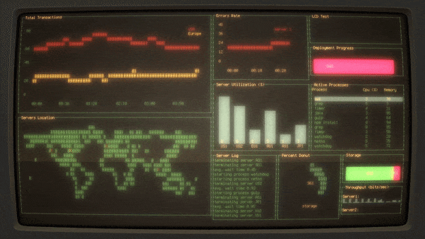

<h1 align="center">
  Welcome to My GitHub
</h1>

  

  
  
  

  

  

    
<i>Hi, I'm Georgiy Kuzora, a software engineer from Russia.</i>

---

## About Me:

I am a passionate Backend Developer with a keen interest in crafting efficient and scalable web services and applications. My expertise lies in Go, Python, and Rust, and I am always eager to expand my knowledge and explore new technologies.

- :hammer_and_wrench: As a Software Engineer, I specialize in building robust web services and applications that meet high standards of performance and reliability.

- :seedling: I am committed to continuous learning and growth. Currently, I am deepening my understanding of Golang and Rust, and I am fascinated by the world of distributed systems and microservices.

- :classical_building: Beyond software development, I have a strong interest in Philosophy, Mindfulness, and Stoicism.

- :black_nib: I maintain a personal blog where I share insights on technology, foreign languages, and mindfulness. 

- :mailbox: You can reach me via: 

---

## Languages and Tools:

  &nbsp;
  &nbsp;
  &nbsp;
  &nbsp;
  &nbsp;
  &nbsp;
  &nbsp;
  &nbsp;
  &nbsp;
  &nbsp;
  &nbsp;
  &nbsp;
  &nbsp;
  &nbsp;
  &nbsp;

---

## My Stats:

---

## Latest Blog Posts:

<!-- BLOG-POST-LIST:START -->
- [Конфигурация окружения разработчика при помощи Nix](http://georgiykuzora.ru/post/nix/)
- [Размышления о развитии разума](http://georgiykuzora.ru/post/rasum/)
- [Веб-приложение - поиск автосервисов](http://georgiykuzora.ru/post/diploma-gb/)
- [Контейнер с dev-сервером Django](http://georgiykuzora.ru/post/local_django_dev_server/)
<!-- BLOG-POST-LIST:END -->

#### You can find more blogposts on 

<!--
- 🔭 I’m currently working on ...
- 🌱 I’m currently learning ...
- 👯 I’m looking to collaborate on ...
- 🤔 I’m looking for help with ...
- 💬 Ask me about ...
- 📫 How to reach me: ...
- 😄 Pronouns: ...
- ⚡ Fun fact: ...
-->
